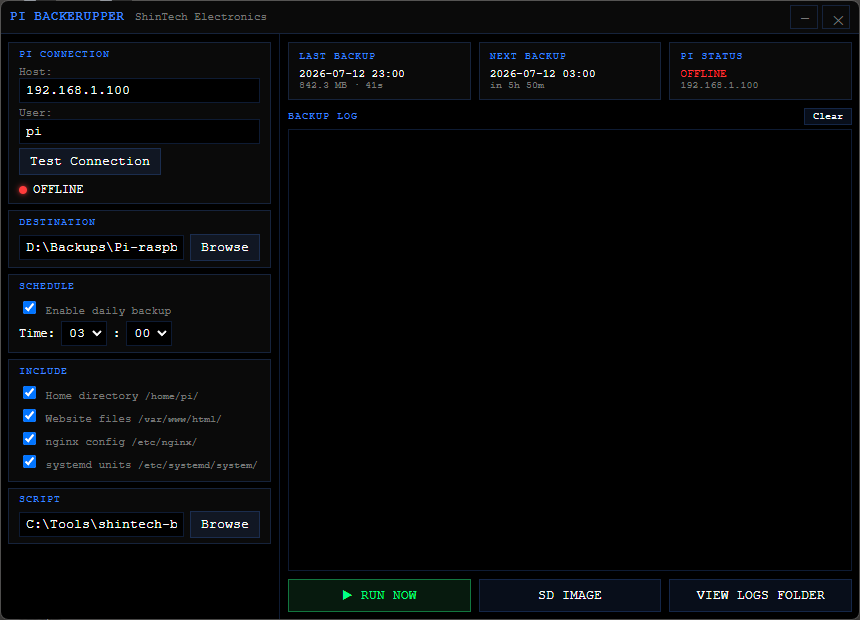

# Pi BackerUpper

A small Electron desktop app for Windows that puts a GUI on top of a
PowerShell rsync backup script for a Raspberry Pi — so you don't have
to run it from the command line or manage Task Scheduler by hand.

It's a wrapper, not a reimplementation: all the actual backup logic
(rsync/scp, SD card imaging, exclusions) lives in a companion
PowerShell script, `shintech-backup.ps1`. This app just builds the
right command line, spawns it, and streams the output into a live
log.



## Features

- Frameless, dark "Hi-Con" themed window
- Connection check against your Pi (ping)
- Pick a backup destination folder and the script to run
- Daily schedule (hour/minute picker), handled in-process while the
  app is open
- Per-source include/exclude checkboxes (home dir, website, nginx
  config, systemd units) — wired straight through to `-Skip*` flags
  on the script
- Run-now / cancel, plus a one-off full SD card image run
- Persisted settings (`electron-store`, with schema validation) and a
  status readout of the last/next backup

## Requirements

- Windows + PowerShell
- [Node.js](https://nodejs.org/) 18+
- A copy of `shintech-backup.ps1`, the companion backup script
- `rsync` on PATH for efficient transfers (falls back to `scp` if
  it's missing), and SSH access to the Pi

## Setup

```powershell
git clone https://github.com/ShinobiFPV/pi-backerupper.git
cd pi-backerupper
npm install
npm start
```

On first launch the app tries to auto-detect `shintech-backup.ps1` at
`~/Projects/ShinTech/shintech-backup/shintech-backup/shintech-backup.ps1`;
if it's somewhere else, point it there with the **Browse** button
under **Script**. Then set a **Destination** folder and, optionally,
a daily **Schedule**.

## Building an installer

```powershell
npm run build
```

Produces a Windows x64 NSIS installer via `electron-builder`.

## Notes

- Nothing here talks to the Pi directly except the connection-test
  ping — every actual backup runs through the PowerShell script as a
  child process.
- The scheduler only runs while the app is open; for a true
  background/service schedule, use the script's own
  `install-backup-task.ps1` (Windows Task Scheduler) instead.

## License

[MIT](LICENSE)
